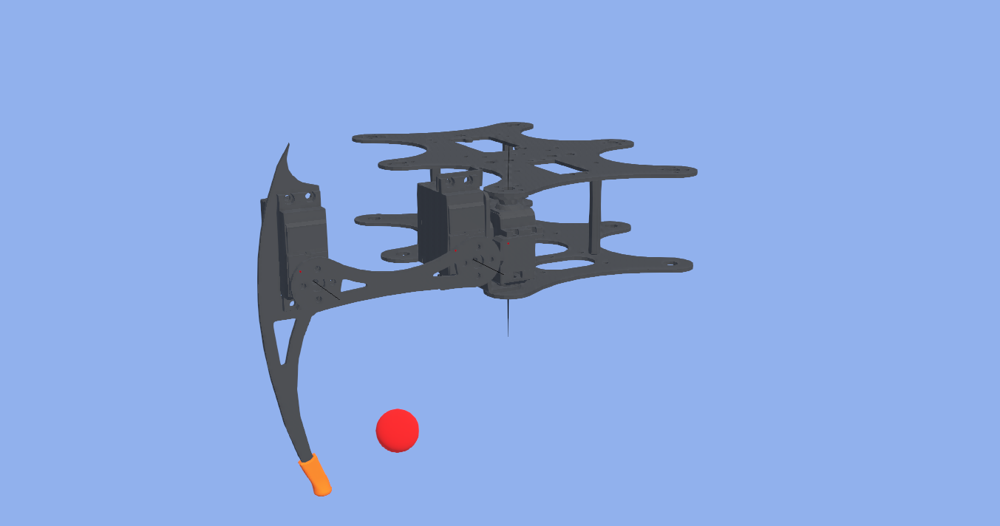

# hexapod-ros2

Hexapod robot control.

# Denavit hartenberg parameters (just body and 1 leg)

* theta is the rotation along z-axis
* alpha is the rotation along x-axis
* r is the translation along x-axis
* d is the translation along z-axis

Joint 1 is virtual. Angles in degrees and distances in centimeters

| Joint | theta | alpha |   r  |   d  |
|:-----:|:-----:|:-----:|:----:|:----:|
|   0   |   0   |   90  | 8.75 | 5.05 |
|   1   |   0   |  -90  |   0  |   0  |
|   2   |  -90  |  -90  | 2.95 | 2.25 |
|   3   |   0   |   0   |   8  |   0  |
